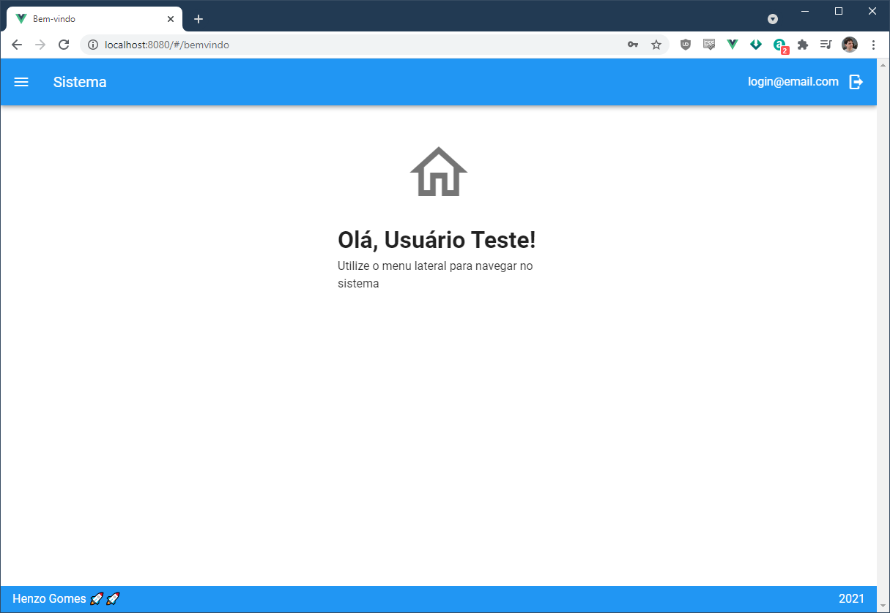

PHP Fullstack - API em Laravel com Vue no frontend
=====

Arquitetura client server com uma API em Laravel no backend, e frontend em Vue.

Setup
=====

Instale o [Docker](https://docs.docker.com/get-started/).

Abra o terminal na raiz da aplicação e digite o comando:
```sh
docker-compose up -d
```


Depois de concluído, o banco MYSQL já está criado e os comandos do artisan de `migrate` e `db:seed` já devem ter sido rodados automaticamente. A API já está pronta e pode ser acessada pela rota `http://localhost:8001/api/`

Para testar se está funcionando pode dar um `GET` na rota `/`:


Rotas
=====

```
+--------+----------+-----------------+------+----------------------------------------------------+------------+
| Domain | Method   | URI             | Name | Action                                             | Middleware |
+--------+----------+-----------------+------+----------------------------------------------------+------------+
|        | GET|HEAD | /               |      | Closure                                            | web        |
|        | GET|HEAD | api             |      | Closure                                            | api        |
|        | GET|HEAD | api/cep         |      | App\Http\Controllers\CepController@getCep          | api        |
|        |          |                 |      |                                                    | auth       |
|        | POST     | api/certificado |      | App\Http\Controllers\SecController@readCertificate | api        |
|        |          |                 |      |                                                    | auth       |
|        | DELETE   | api/delete/{id} |      | App\Http\Controllers\UserController@destroy        | api        |
|        |          |                 |      |                                                    | auth       |
|        | GET|HEAD | api/index       |      | App\Http\Controllers\UserController@index          | api        |
|        |          |                 |      |                                                    | auth       |
|        | GET|HEAD | api/login       |      | App\Http\Controllers\AuthController@login          | api        |
|        | GET|HEAD | api/me          |      | App\Http\Controllers\AuthController@me             | api        |
|        |          |                 |      |                                                    | auth       |
|        | POST     | api/store       |      | App\Http\Controllers\UserController@store          | api        |
|        |          |                 |      |                                                    | auth       |
|        | POST     | api/update/{id} |      | App\Http\Controllers\UserController@update         | api        |
|        |          |                 |      |                                                    | auth       |
|        | GET|HEAD | api/user        |      | Closure                                            | api        |
|        |          |                 |      |                                                    | auth:api   |
|        | GET|HEAD | api/user/{id}   |      | App\Http\Controllers\UserController@show           | api        |
|        |          |                 |      |                                                    | auth       |
+--------+----------+-----------------+------+----------------------------------------------------+------------+

```

- Antes de consumir a API é necessário logar chamando a rota de login com o usuário `login@email.com` senha `123456` (esses dados estão parametrizados no `.env`)
- O login irá retornar um token que deve ser usado para autenticar as demais rotas.
- Também está disponível na pasta `postman` uma collection e um environment do Postman com todas as rotas. Essa collection já está pronta para adicionar automaticamente o token retornado pelo login em todas as requisições.


Teste unitários
=====

Para rodar os testes, será necessário entrar no container do Docker para rodar o comando.

- Para listar os containers use o comando `docker ps`


- O nome do container é `laravel-fullstack_apache_with_php_1`
- Pode ser acessado com o comando `docker exec -it laravel-fullstack_apache_with_php_1 bash`

- Para rodar os testes, rode o comando `php artisan test`


DB
=====

Configuração do DB. User `admin` senha `1234` (parametrizado no .env)

Screenshots
=====





